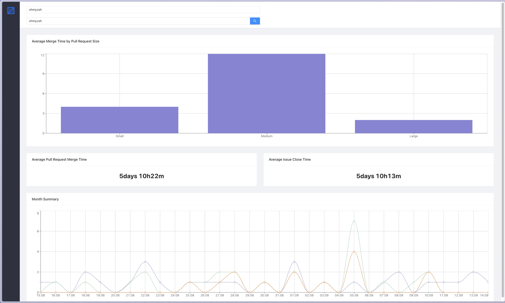

# GitHub Analytics



## Purpose

A Dashboard Application that shows metrics about GitHub's projects such as status of PRs day by day, average Issue close time and average PR merge time by total of PRs or grouped by size.

## Dependencies

### Libraries

- Ant Design
- Axios
- Create React App
- Moment
- Recharts

### Tools

- Node
- Yarn

## Environment Configuration

The project needs a environment configuration file to be able to run.\
You need to have a `.env.local` at the root of the project with the below variables configured:

- REACT_APP_GITHUB_API_URL
- REACT_APP_GITHUB_ACCESS_TOKEN

Place your GitHub access token after `REACT_APP_GITHUB_ACCESS_TOKEN=` inside the file.\
And place the GitHub API URL that your web app will communicate with after `REACT_APP_GITHUB_API_URL=`.

You can use the file `.env.local.sample` at the root of the project as source to`env.local`

## Execution

To execute the project, run on the command line:

```
yarn install
yarn start
```

## Tests

To execute the tests, run on the command line:

```
yarn test
```
